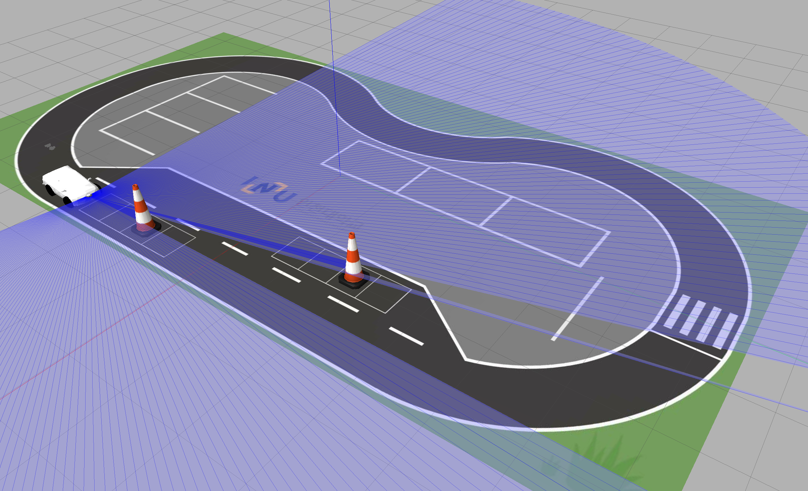

# unita_minicar_sim_ws

다음 세대 동아리원을 위한 미니카(Gazebo) 시뮬레이터 워크스페이스입니다.



## 구성 패키지
- `minicar_simulation`: Gazebo 월드/런치, 제어 송신 노드
- `minicar_description`: URDF/메시
- `camera_perception_pkg`: YOLOv8 기반 인지 + 차선 정보 추출
- `decision_making_pkg`: 경로/모션 플래너
- `debug_pkg`: 시각화/디버그 노드
- `interfaces_pkg`: 커스텀 메시지

## 요구사항
- ROS 2 (권장: Humble) + `gazebo_ros` (Gazebo Classic)
- Python 패키지(인지 노드용): `ultralytics`, `torch`

## 빌드
```sh
# 워크스페이스 루트에서 실행
cd /path/to/unita_minicar_sim_ws
source /opt/ros/$ROS_DISTRO/setup.bash
rosdep install --from-paths src --ignore-src -r -y
colcon build --symlink-install
source install/setup.bash
```

인지 노드가 `ultralytics`를 못 찾는다면:
```sh
python3 -m pip install -U ultralytics torch
```

## 실행
```sh
# 워크스페이스 루트에서 실행(기본 YOLO 모델 경로가 CWD 기준)
ros2 launch minicar_simulation drive_car.launch.py
```